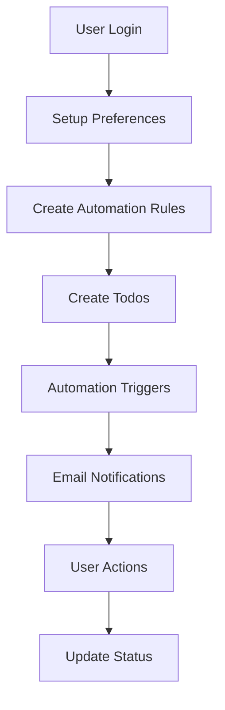

# 🚀 Agent TODO - Quick Start Guide

## 📋 **Tóm tắt hệ thống**

Agent TODO là ứng dụng quản lý công việc với:
- ✅ **Todo Management** - CRUD operations
- 📧 **Email Notifications** - SMTP integration
- ⚙️ **User Preferences** - Personal settings
- 🤖 **Automation Rules** - Smart automation
- 📁 **Groups & Tags** - Organization

---

## 🚀 **Quick Start**

### **1. Start Services**
```bash
# Start all services
docker-compose up -d

# Check status
docker-compose ps
```

### **2. Access APIs**
- **API Base:** http://localhost:8000
- **Swagger UI:** http://localhost:8000/docs
- **Health Check:** http://localhost:8000/health

### **3. Test Authentication**
```bash
# Register user
curl -X POST http://localhost:8000/api/v1/auth/register \
  -H "Content-Type: application/json" \
  -d '{"email": "test@example.com", "password": "password123", "full_name": "Test User"}'

# Login
curl -X POST http://localhost:8000/api/v1/auth/login \
  -H "Content-Type: application/json" \
  -d '{"email": "test@example.com", "password": "password123"}'
```

---

## 📚 **Documentation**

- **API Documentation:** `API_DOCUMENTATION.md`
- **User Flow Guide:** `USER_FLOW_GUIDE.md`
- **Interactive Docs:** http://localhost:8000/docs

---

## 🔧 **Configuration**

### **Environment Variables (.env)**
```bash
# Database
DATABASE_URL=postgresql+psycopg2://user:password@db:5432/agent_plan

# SMTP (Gmail)
SMTP_HOST=smtp.gmail.com
SMTP_PORT=587
SMTP_USER=your-email@gmail.com
SMTP_PASSWORD=your-app-password
SMTP_FROM_EMAIL=your-email@gmail.com

# Redis
REDIS_URL=redis://localhost:6379/0
CELERY_BROKER_URL=redis://localhost:6379/0
```

### **Gmail Setup**
1. Enable 2FA on Gmail
2. Create App Password
3. Update .env with App Password

---

## 🎯 **Key Features**

### **1. Todo Management**
- Create, Read, Update, Delete todos
- Mark as completed/important
- Due date management
- Group and tag organization

### **2. Email Notifications**
- SMTP integration with Gmail
- Background processing with Celery
- Retry logic for failed emails
- Template-based email content

### **3. User Preferences**
- Work hours configuration
- Language and timezone settings
- Default group selection
- Notification preferences

### **4. Automation Rules**
- Trigger-based automation
- Condition evaluation
- Action execution
- Real-time processing

---

## 🔄 **Typical Workflow**



---

## 🛠️ **Development**

### **Backend Structure**
```
server/
├── app/
│   ├── models/          # Database models
│   ├── schemas/         # Pydantic schemas
│   ├── routers/         # API endpoints
│   ├── services/        # Business logic
│   ├── tasks/           # Celery tasks
│   └── main.py          # FastAPI app
├── alembic/             # Database migrations
└── requirements.txt     # Dependencies
```

### **Key Components**
- **FastAPI:** Web framework
- **SQLAlchemy:** ORM
- **Alembic:** Migrations
- **Celery:** Background jobs
- **Redis:** Message broker
- **PostgreSQL:** Database

---

## 📊 **Monitoring**

### **Check Services**
```bash
# Service status
docker-compose ps

# View logs
docker-compose logs api
docker-compose logs celery-worker
```

### **Health Checks**
```bash
# API health
curl http://localhost:8000/health

# Database connection
curl http://localhost:8000/api/v1/todos/ -H "Authorization: Bearer <token>"
```

---

## 🎉 **Ready to Use!**

Hệ thống đã sẵn sàng với đầy đủ tính năng:
- ✅ Authentication & Authorization
- ✅ Todo CRUD operations
- ✅ Email notifications
- ✅ User preferences
- ✅ Automation rules
- ✅ Background processing
- ✅ API documentation

**Happy Coding! 🚀**
