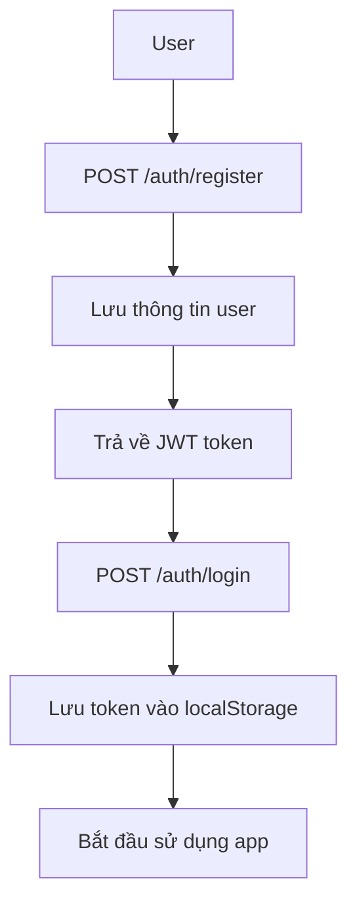
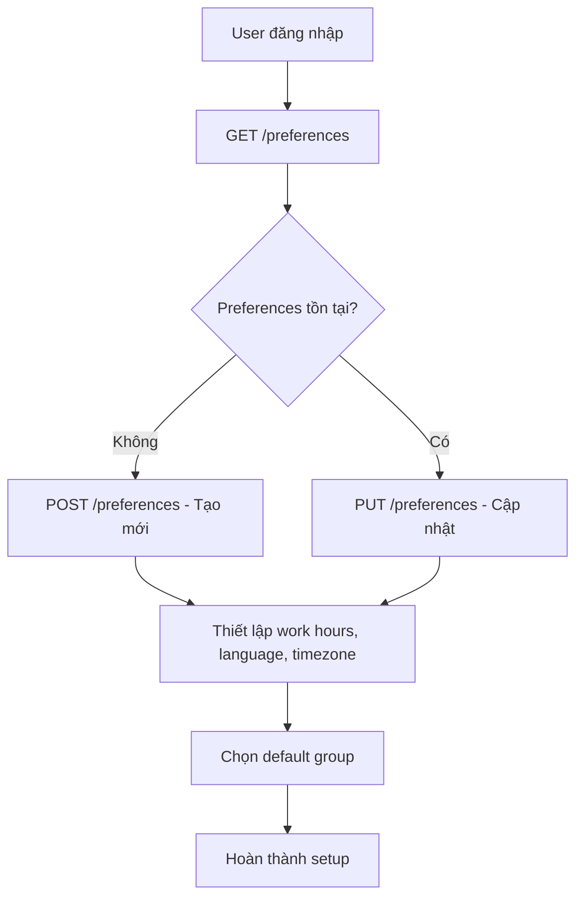
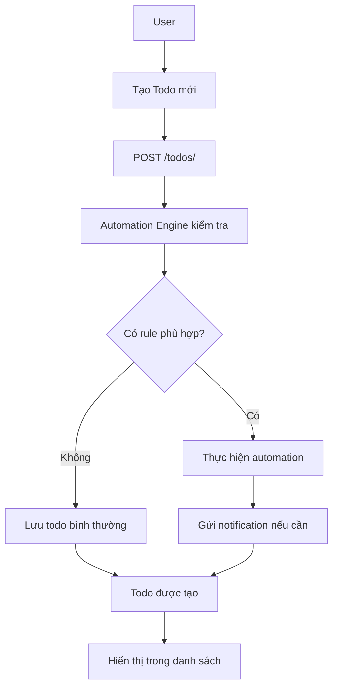
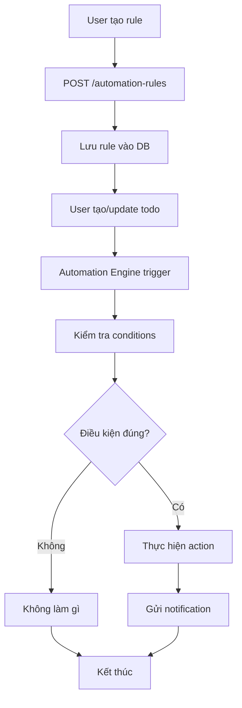
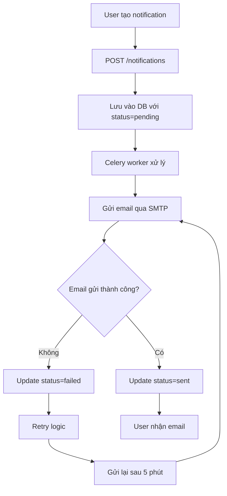
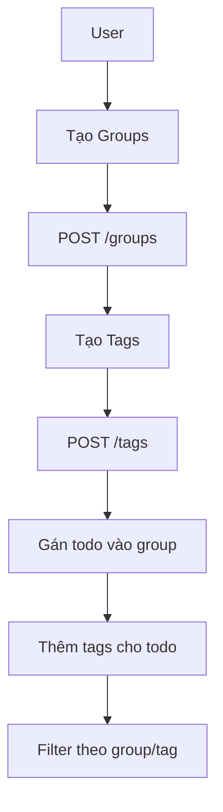

# 🎯 Agent TODO - User Flow Guide

## 📋 **Tổng quan hệ thống**

Agent TODO là một ứng dụng quản lý công việc với các tính năng:
- ✅ **Todo Management** - Quản lý công việc
- 📧 **Email Notifications** - Thông báo qua email
- ⚙️ **User Preferences** - Tùy chỉnh cá nhân
- 🤖 **Automation Rules** - Tự động hóa thông minh
- 📁 **Groups & Tags** - Phân loại công việc

---

## 🚀 **Flow sử dụng chính**

### **1. 🔐 Đăng ký & Đăng nhập**



**Bước thực hiện:**
1. **Register:** Tạo tài khoản mới
2. **Login:** Đăng nhập để lấy JWT token
3. **Lưu token:** Frontend lưu token để gọi API

---

### **2. ⚙️ Setup User Preferences**



**Các tùy chỉnh quan trọng:**
- **Work Hours:** Giờ làm việc (08:00 - 17:00)
- **Language:** Ngôn ngữ (vi, en)
- **Timezone:** Múi giờ (Asia/Ho_Chi_Minh)
- **Default Group:** Nhóm mặc định cho todo mới
- **Notification Preferences:** Email/Push notifications

---

### **3. 📝 Quản lý Todo**



**Các thao tác chính:**
- **Create:** Tạo todo mới
- **Update:** Chỉnh sửa todo
- **Complete:** Đánh dấu hoàn thành
- **Delete:** Xóa todo
- **Filter:** Lọc theo trạng thái, group, tag

---

### **4. 🤖 Automation Rules**



**Các loại triggers:**
- **on_todo_created:** Khi tạo todo mới
- **on_tag_added:** Khi thêm tag
- **on_due_date:** Khi đến hạn
- **on_completed:** Khi hoàn thành

**Các điều kiện (conditions):**
```json
{
  "if_content_contains": ["urgent", "asap"],
  "if_tag_is": "urgent",
  "if_due_within_days": 3,
  "if_important": true
}
```

**Các hành động (actions):**
```json
{
  "set_priority": "high",
  "move_to_group": "group_id",
  "add_tag": "urgent",
  "send_notification": {
    "subject": "Task Alert",
    "content": "Your todo needs attention"
  }
}
```

---

### **5. 📧 Email Notifications**



**Các loại notifications:**
- **Task Reminders:** Nhắc nhở công việc
- **Due Date Alerts:** Cảnh báo hạn
- **Automation Alerts:** Thông báo từ automation
- **System Notifications:** Thông báo hệ thống

---

### **6. 📁 Groups & Tags Management**



**Workflow:**
1. **Tạo Groups:** Work, Personal, Shopping, etc.
2. **Tạo Tags:** urgent, important, meeting, etc.
3. **Gán todo:** Chọn group và tags phù hợp
4. **Filter:** Lọc todo theo group/tag

---

## 🎯 **Các Use Cases thực tế**

### **Use Case 1: Quản lý công việc hàng ngày**

```bash
# 1. Setup preferences
POST /preferences
{
  "work_hours": {"start": "09:00", "end": "18:00"},
  "language": "vi",
  "timezone": "Asia/Ho_Chi_Minh"
}

# 2. Tạo automation rule
POST /automation-rules
{
  "name": "Auto-important for urgent",
  "trigger": "on_todo_created",
  "conditions": {"if_content_contains": ["urgent", "gấp"]},
  "action": {"set_priority": "high"}
}

# 3. Tạo todo
POST /todos/
{
  "title": "Gấp: Hoàn thành báo cáo",
  "description": "Báo cáo cần hoàn thành trước 17h"
}
# → Tự động set is_important = true
```

### **Use Case 2: Nhắc nhở deadline**

```bash
# 1. Tạo notification
POST /notifications
{
  "todo_id": "todo-uuid",
  "notify_at": "2025-10-20T09:00:00Z",
  "subject": "Deadline sắp đến",
  "content": "Task 'Hoàn thành báo cáo' sắp đến hạn"
}

# 2. Celery sẽ gửi email vào 9h sáng
```

### **Use Case 3: Automation thông minh**

```bash
# 1. Rule: Tự động gán tag "meeting" cho todo có từ "họp"
POST /automation-rules
{
  "name": "Auto-tag meetings",
  "trigger": "on_todo_created",
  "conditions": {"if_content_contains": ["họp", "meeting"]},
  "action": {
    "add_tag": "meeting",
    "move_to_group": "work-group-id"
  }
}

# 2. Tạo todo
POST /todos/
{
  "title": "Họp team vào 2h chiều"
}
# → Tự động thêm tag "meeting" và chuyển vào work group
```

---

## 🔧 **Setup & Configuration**

### **1. Environment Variables**

```bash
# .env file
SMTP_HOST=smtp.gmail.com
SMTP_PORT=587
SMTP_USER=your-email@gmail.com
SMTP_PASSWORD=your-app-password
SMTP_FROM_EMAIL=your-email@gmail.com

REDIS_URL=redis://localhost:6379/0
CELERY_BROKER_URL=redis://localhost:6379/0
```

### **2. Gmail Setup**

1. **Enable 2FA** trên Gmail
2. **Tạo App Password:**
   - Google Account → Security
   - 2-Step Verification → App passwords
   - Generate password cho "Mail"
3. **Update .env** với App Password

### **3. Docker Services**

```bash
# Start all services
docker-compose up -d

# Services:
# - api: FastAPI backend (port 8000)
# - db: PostgreSQL database (port 5432)
# - redis: Redis cache (port 6379)
# - celery-worker: Background jobs
# - celery-beat: Scheduled todos
```

---

## 📊 **Monitoring & Debugging**

### **1. Check Services Status**
```bash
docker-compose ps
```

### **2. View Logs**
```bash
# API logs
docker-compose logs api

# Celery logs
docker-compose logs celery-worker

# Database logs
docker-compose logs db
```

### **3. Test API**
```bash
# Health check
curl http://localhost:8000/health

# Test authentication
curl -X POST http://localhost:8000/api/v1/auth/login \
  -H "Content-Type: application/json" \
  -d '{"email": "test@example.com", "password": "password"}'
```

---

## 🎨 **Frontend Integration**

### **1. Authentication Flow**
```javascript
// Login
const response = await fetch('/api/v1/auth/login', {
  method: 'POST',
  headers: { 'Content-Type': 'application/json' },
  body: JSON.stringify({ email, password })
});
const { access_token } = await response.json();
localStorage.setItem('token', access_token);
```

### **2. API Calls với Token**
```javascript
const token = localStorage.getItem('token');
const response = await fetch('/api/v1/todos/', {
  headers: {
    'Authorization': `Bearer ${token}`,
    'Content-Type': 'application/json'
  }
});
```

### **3. Error Handling**
```javascript
if (response.status === 401) {
  // Token expired, redirect to login
  localStorage.removeItem('token');
  window.location.href = '/login';
}
```

---

## 🚀 **Best Practices**

### **1. Security**
- ✅ Luôn sử dụng HTTPS trong production
- ✅ Validate input data
- ✅ Rate limiting cho API
- ✅ Secure JWT secret

### **2. Performance**
- ✅ Sử dụng pagination cho list APIs
- ✅ Cache frequently accessed data
- ✅ Optimize database queries
- ✅ Background processing cho heavy todos

### **3. User Experience**
- ✅ Real-time notifications
- ✅ Offline support
- ✅ Mobile responsive
- ✅ Intuitive UI/UX

---

## 📚 **Tài liệu tham khảo**

- **API Documentation:** http://localhost:8000/docs
- **OpenAPI Spec:** http://localhost:8000/openapi.json
- **Health Check:** http://localhost:8000/health

**Happy Coding! 🎉**
